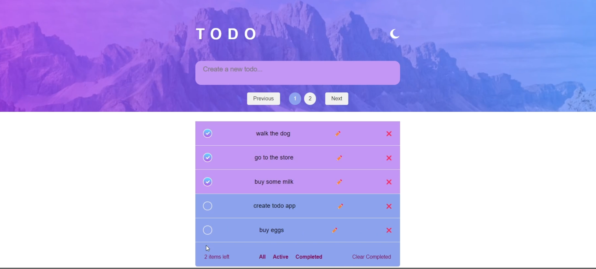
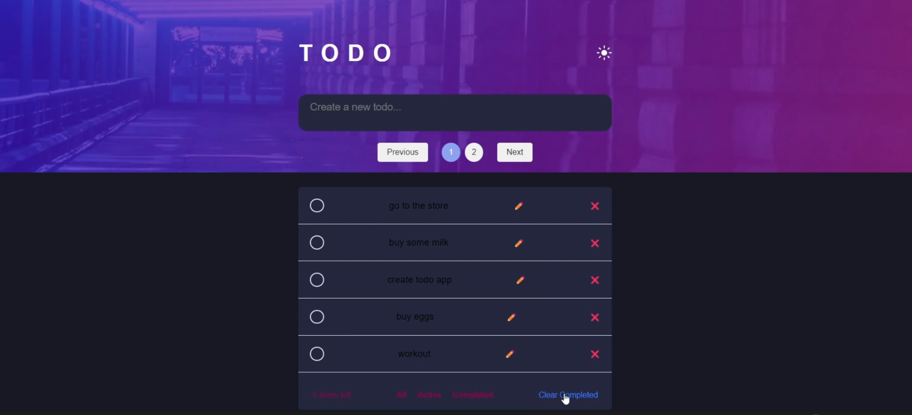

# TODO-App-Front-End

This is the frontend part of a simple TODO app that allows you to manage your tasks. The frontend is built using HTML, CSS, and JavaScript.

## Features

- Add new tasks
- Update task details
- Delete tasks
- Mark tasks as completed
- Filter tasks based on their completion status
- Pagination for viewing tasks

## Demo

You can see a live demo of the app (https://youtu.be/zJRZliaZRIo).

## Screenshots

## Getting Started

To run the frontend of the app locally, follow these steps:

1. Clone this repository:

git clone https://github.com/your-username/todo-frontend.git

2. Navigate To index.html 
